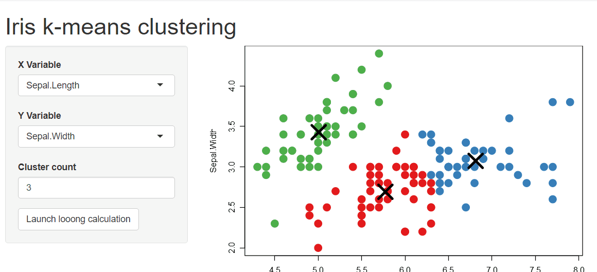

# shinybusy

> Automated (or not) busy indicator for Shiny apps & other progress / notifications tools

<!-- badges: start -->
[](https://CRAN.R-project.org/package=shinybusy)
[](https://CRAN.R-project.org/package=shinybusy)
[](https://www.repostatus.org/#active)
[](https://github.com/dreamRs/shinybusy/actions/workflows/R-CMD-check.yaml)
[](https://app.codecov.io/gh/dreamRs/shinybusy?branch=master)
<!-- badges: end -->


## Installation

Install from [CRAN](https://cran.r-project.org/package=shinybusy) with:

```r
install.packages("shinybusy")
```

You can install dev version of `shinybusy` from [GitHub](https://github.com/dreamRs/shinybusy):

```r
remotes::install_github("dreamRs/shinybusy")
```


## Examples

### Automated busy indicators

#### Gif

Animate a Gif when server is busy and pause animation when server is idle :

```r
# Somewhere in UI
add_busy_gif(src = "https://jeroen.github.io/images/banana.gif", height = 70, width = 70)
```


#### Progress bar

Make an infinite progress bar appear on top of the page when server is busy :

```r
add_busy_bar(color = "#FF0000")
```




#### Spinner

Add a spinner when server is busy on top-right corner of the page with:

```r
add_busy_spinner(spin = "fading-circle")
```


### Other functionalities

Display a loading indicator at the start of the application until it is ready to be used, block application interaction until a calculation is done, send notifications to user, ... See vignette or [online website](https://dreamrs.github.io/shinybusy/) for more.


## Development

This package use [{packer}](https://github.com/JohnCoene/packer) to manage JavaScript assets, see packer's [documentation](https://packer.john-coene.com/#/) for more.

Install nodes modules with:

```r
packer::npm_install()
```

Modify `srcjs/exts/busy.js` (or other scripts), then run:

```r
packer::bundle()
```

Re-install R package and try demo applications in `examples/`.


## Other related packages

These packages provide cool alternative to add progress indicator in shiny application :

* [{waiter}](https://github.com/JohnCoene/waiter) : Loading screens for Shiny
* [{shinycssloaders}](https://github.com/daattali/shinycssloaders) : Add CSS loader animations to Shiny outputs
* [{shinycustomloader}](https://github.com/emitanaka/shinycustomloader) : Add a custom loader for R shiny


## Acknowledgements

Development of this package was funded by Silex Technologies (https://www.silex-ip.com)


