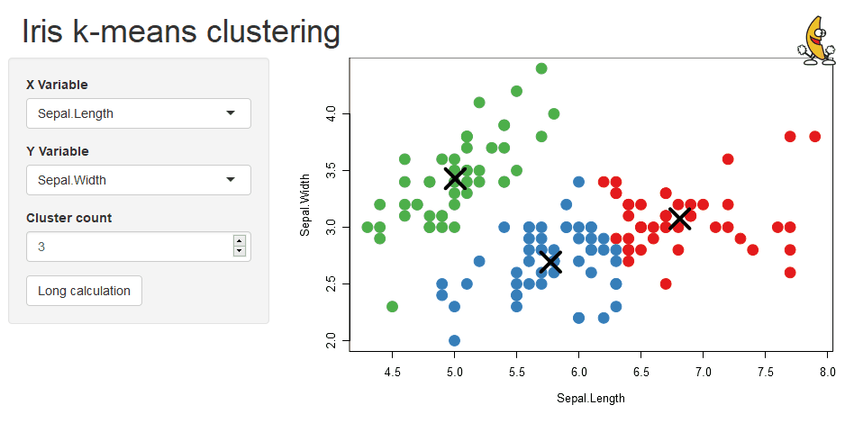
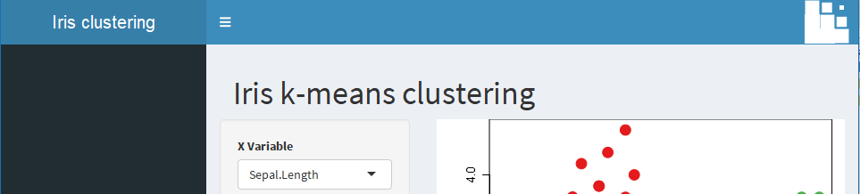
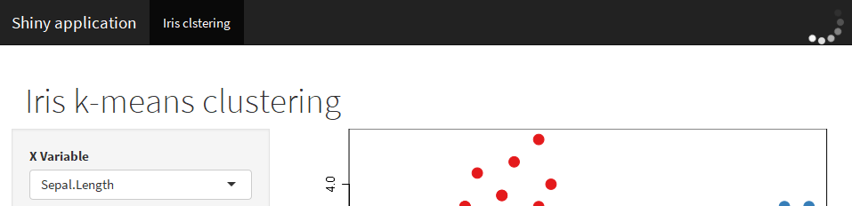

# shinybusy

> Minimal busy indicator for Shiny apps

[](https://travis-ci.org/dreamRs/shinybusy)
[](https://www.repostatus.org/#wip)


## Installation

You can install `shinybusy` from GitHub:

``` r
remotes::install_github("dreamRs/shinybusy")
```

## Examples


### Gif

Animate a Gif when server is busy and pause animation when server is idle :

```r
# Somewhere in UI
add_busy_gif(src = "https://jeroen.github.io/images/banana.gif", height = 70, width = 70)
```



### Spinner

Add a spinner when server is busy on top right corner of the page with:


```r
# UI
add_busy_spinner(spin = "fading-circle")
```
Classic Shiny:


Shinydashboard:


Shinythemes:



